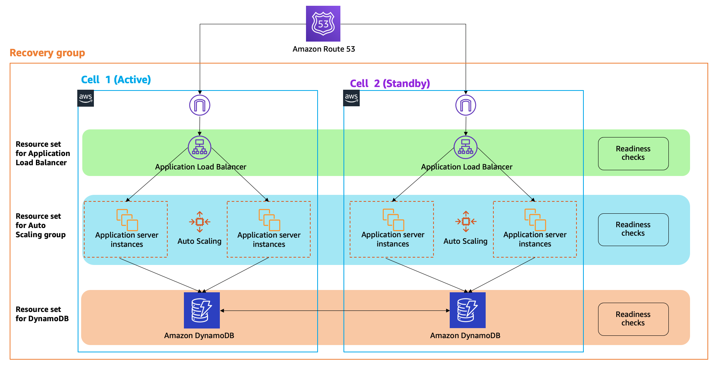

# Running recovery-oriented applications with Amazon Route 53 Application Recovery Controller, AWS CI/CD tools, and Terraform

## Introduction

This repository supports a blog post on Route 53 Application Recovery Controller, AWS CI/CD tools, and Terraform. It deploys a sample web app, the **_SignUp application_**. This app allows customers to enter their contact information so that they can be notified when a new product from the New Startup company officially launches. The SignUp application is written in NodeJS.

It runs in active/standby mode across two AWS Regions, with two Availability Zones per Region, and stores data in a DynamoDB global table that resides in the same two AWS Regions. Route 53 ARC’s routing controls will front each of the deployments at the application layer. To perform a Regional failover, you update routing control states to stop traffic to the active Region and start traffic to the standby Region.



## Pre-requisites
Before you start, make sure that you have the following created or installed and ready to use:

1) An AWS account with administrator access and the ability to create a new [Virtual Private Cloud (VPC)](https://aws.amazon.com/vpc/).
1) The latest version of the [AWS command line interface (CLI)](https://docs.aws.amazon.com/cli/latest/userguide/install-cliv2.html).
1) The latest version of [Hashicorp Terraform](https://learn.hashicorp.com/tutorials/terraform/install-cli?in=terraform/aws-get-started), with [your environment variables configured for AWS](https://registry.terraform.io/providers/hashicorp/aws/latest/docs).
1) The [JSON file processor (jq)](https://stedolan.github.io/jq/).
1) A Route 53 domain name (public or private) that you can use to create two DNS A (type Failover) records for the application.

## Set the DNS variables
Update the _DNS Hosted Zone_ and _DNS Domain Name_ variables to use the values that correspond to your Route 53 domain name, as described in the prerequisites section.

To make the updates, do the following:
1)	Edit the `set-terraform-variables.sh` file.
1)	On lines 10 and 11, update the following variables to use the values for your own DNS domain name.
```
export TF_VAR_DNSHostedZone=Z0ABCDEFG9Z
export TF_VAR_DNSDomainName=gtphonehome.com
```

## Create the AWS infrastructure in two Regions
The shell script below creates the AWS infrastructure in two Regions. Redirect the script output to a local file so that you can track the deployment progress and make sure that the AWS resources were created successfully.

```
./create-db-app-cicd-stack.sh > my_terraform_create.log 2>&1
```

The scripts uses Terraform to perform the create the following AWS resources:
- An Amazon S3 bucket, which will be used as a source code repository for the CI/CD pipeline.
- An Amazon DynamoDB global table and the supporting AWS infrastructure to run the application in two AWS Regions.
- A CI/CD pipeline that includes an approval action to deploy the application, one Region at a time, by using CodePipeline, CodeBuild, and CodeDeploy.
- The Route 53 ARC components for readiness checks and routing controls, Route 53 Health Checks, and Route 53 DNS records.

It may take up to 20 minutes for the script to create all the AWS resources in both Regions.

## Deploy the SignUp application
The sample CI/CD pipeline has five stages, including an approval action. Initially, the pipeline deploys the application just to the active Region. The first three stages run automatically, without manual intervention:

- In the **Source stage**, the process starts automatically by getting the source code from the S3 bucket. The script created the S3 bucket and uploaded the source code. You can find the source code in the `nodejs-sample-app` folder.

- For the **Build stage**, AWS CodeBuild uses an Amazon Linux container to install the NodeJS runtime and install all of the application’s dependencies. The buildspec section of the CodeBuild project contains the commands to run the continuous integration process.

- In the **Deploy-to-Region-1** stage, AWS CodeDeploy uses an application specification file (AppSpec file) to manage each deployment as a series of lifecycle event hooks. You can find the AppSpec file at `nodejs-sample-app/appspec.yml`. This stage deploys the application to the Auto Scaling group called `tf-arc-asg`, which is associated to the target group `tf-arc-tgrp` of the Application Load Balancer. In this example, CodeDeploy deploys the application to only one EC2 instance at a time and leverages the Application Load Balancer to prevent internet traffic from being routed to an instance while it's being updated. The Application Load Balancer also makes the instance available for traffic again after deployment to that instance is complete. In addition, the deployment is configured to automatically roll back when a deployment fails.

At this point, the pipeline execution stops and waits for you to verify successful deployment in the active Region. Then you can manually approve proceeding to deploy in the standby Region.  

- The **Manual-Approval stage** lets you verify that the application deployed successfully in the active Region before you deploy the app in the standby Region. To verify, start by choosing Review, which opens a comments section for you to enter confirmation text. Before you confirm and continue, check that the application you deployed is up and running. To do this, access the DNS name of the load balancer in the active Region. To view the DNS name to use, in the Amazon EC2 console, navigate to the Load Balancer page. Enter the corresponding DNS name in a browser, and then make sure that you see the home page for the SignUp application. Now that you've confirmed that the application is deployed, enter a comment in the text field, and choose Approve to continue the deployment to the standby Region. By using this approach, you have the option to stop the deployment if there's a problem with the release, which prevents a bad version from propagating to the standby Region as well as the active Region. This lets you avoid correlated failures between Regions.

- After you approve the review, the **Deploy-to-Region-2 stage** deploys the application to the standby Region, following the same deployment mechanism as the Deploy-to-Region-1 stage. Finally, check that the application is up and running on the standby Region, by accessing the DNS name of the load balancer in that Region.

## Turn on a Route 53 ARC's routing control state
When a routing control state is ON, traffic flows to the cell controlled by that routing control. When the script finishes, both routing control states are set to OFF. To enable traffic to flow to the active Region, turn on the routing control state for that Region by following the steps in the AWS documentation for using the AWS CLI. (You can also update routing control states on the Amazon Route 53 console in the AWS Management Console but we recommend that you use the Route 53 ARC API, for example, by using the AWS CLI.)

Note that to work with routing control states, you must connect to one of the Regional cluster endpoints. You can view the list of Regional cluster endpoints for your cluster in the Route 53 console, or by using an API action, DescribeCluster. Your process for getting and changing routing control states should be prepared to try each endpoint in rotation, since cluster endpoints are cycled through available and unavailable states for regular maintenance and updates. For code examples that explain how to rotate through Regional cluster endpoints to get and set routing control states, see API examples for Application Recovery Controller

You can get the Amazon Resource Name (ARN) of your routing control from the Route 53 ARC control panel that contains it, which is called `tf-arc-ControlPanel`. We'll update the routing control state for one Region by running the following AWS CLI command, `update-routing-control-state`:

```
aws route53-recovery-cluster update-routing-control-state \
--routing-control-arn \
arn:aws:route53-recovery-control::111122223333:controlpanel/0123456bbbbbbb0123456bbbbbb0123456/routingcontrol/abcdefg1234567 \
--routing-control-state On \
--region us-west-2 \
--endpoint-url https://host-dddddd.us-west-2.example.com/v1
```

When the request is successful, the response is empty.

Your routing controls are durably stored in clusters located in five AWS Regions and changes are coordinated across cluster endpoints. In addition, these changes go through Route 53’s data plane, which has a 100% availability SLA.

## Test a Regional failover
To fail over from one Region to another, you change routing control states to reroute traffic.
Let’s say that an unplanned event causes an outage in the active Region for the SignUp application that prevents your users from accessing the application. Unplanned events can include elevated latency, application errors, human errors, and infrastructure outages caused by natural disasters or hardware failures. You can use Route 53 ARC to quickly fail over traffic from the active Region to the standby Region. As a result, your users can continue to access the application and you can achieve your low recovery point objective (RPO) and recovery time objective (RTO).

To fail over traffic, you must manually set the routing control state for your active Region to OFF to stop sending traffic to it. Then, you must set the standby Region’s routing control state to ON to start traffic flowing there. You can update several routing controls at the same time with one API call: `update-routing-control-states`. When the request is successful, the response is empty.

Here is an example:

```
aws route53-recovery-cluster update-routing-control-states \
--update-routing-control-state-entries '[{"RoutingControlArn": "arn:aws:route53-recovery-control::111122223333:controlpanel/0123456bbbbbbb0123456bbbbbb0123456/routingcontrol/abcdefg1234567", "RoutingControlState": "Off"},
{"RoutingControlArn": "arn:aws:route53-recovery-control::111122223333:controlpanel/0123456bbbbbbb0123456bbbbbb0123456/routingcontrol/hijklmnop987654321", "RoutingControlState": "On"}]' \
--region us-west-2 \
--endpoint-url https://host-dddddd.us-west-2.example.com/v1
```

After a few seconds, the DNS address is updated, and application traffic is now routed to the standby Region. Now that you've successfully shifted traffic to the standby Region, you can start troubleshooting the issue that caused the outage in the active Region.

## Test a Regional failback
You can also fail back traffic to the active Region after the issue that triggered the Regional failover gets resolved. Set the routing control state for the standby Region to OFF to stop sending traffic there, and set the routing control state for the active Region to ON to start traffic flowing there again. As with failover, you can make these changes in one CLI update by using the update-routing-control-states API operation. Here's an example:

```
aws route53-recovery-cluster update-routing-control-states \
--update-routing-control-state-entries '[{"RoutingControlArn": "arn:aws:route53-recovery-control::111122223333:controlpanel/0123456bbbbbbb0123456bbbbbb0123456/routingcontrol/abcdefg1234567", "RoutingControlState": "On"},
{"RoutingControlArn": "arn:aws:route53-recovery-control::111122223333:controlpanel/0123456bbbbbbb0123456bbbbbb0123456/routingcontrol/hijklmnop987654321", "RoutingControlState": "Off"}]' \
--region us-west-2 \
--endpoint-url https://host-dddddd.us-west-2.example.com/v1
```

After a few seconds, the DNS address is updated and application traffic is now re-routed back to the active Region.

## Clean up
To reduce costs, you can delete the AWS resources that you created for the example in this blog. To assist you, you can use a script that we provide to remove resources. The shell script called `destroy-db-app-cicd-stack.1.sh` performs the following actions:
- Deletes the Route 53 ARC components for readiness checks and routing controls, Route 53 Health Checks, and Route 53 DNS records.
- Deletes the CI/CD pipeline.
- Deletes the AWS infrastructure in two AWS Regions.
- Deletes the Amazon DynamoDB global table.
- Deletes the Amazon S3 Bucket where a copy of the source code was stored.

Run the shell script and redirect its output to a local file so that you can track progress of the deletion process and make sure that all AWS resources were deleted successfully. To run the script, type the following at a terminal command prompt:

```
./destroy-db-app-cicd-stack.sh > my_terraform_delete.log 2>&1
```

It may take up to 20 minutes to delete all AWS resources in both Regions.

## Note

1) The AWS resources this sample creates will result in charges to your AWS account. The total cost depends on how long you keep the AWS resources. Please be sure to clean up all resources by deleting the Terraform templates when they are no longer required.

1) These templates assume familiarity and experience with AWS products and features such as Amazon Route 53, CodePipeline, CodeBuild, CodeDeploy, and prior account preparation according to the guidelines available on this documentation is required. If you have not used these AWS services in your account prior to deploying these templates, please refer to this documentation before commencing.

**This sample is provided for demonstration and learning purposes only, and should be reviewed for alignment with organizational policies and best practices before any production use.**


## Security

See [CONTRIBUTING](CONTRIBUTING.md#security-issue-notifications) for more information.

## License

This library is licensed under the MIT-0 License. See the LICENSE file.
